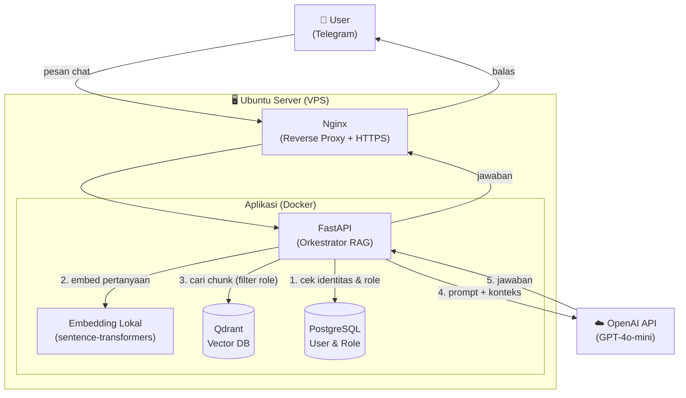
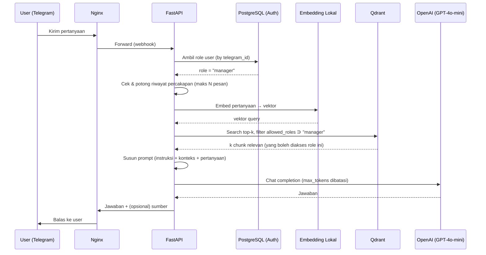
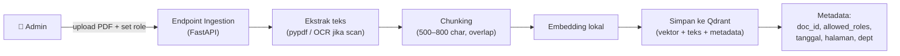
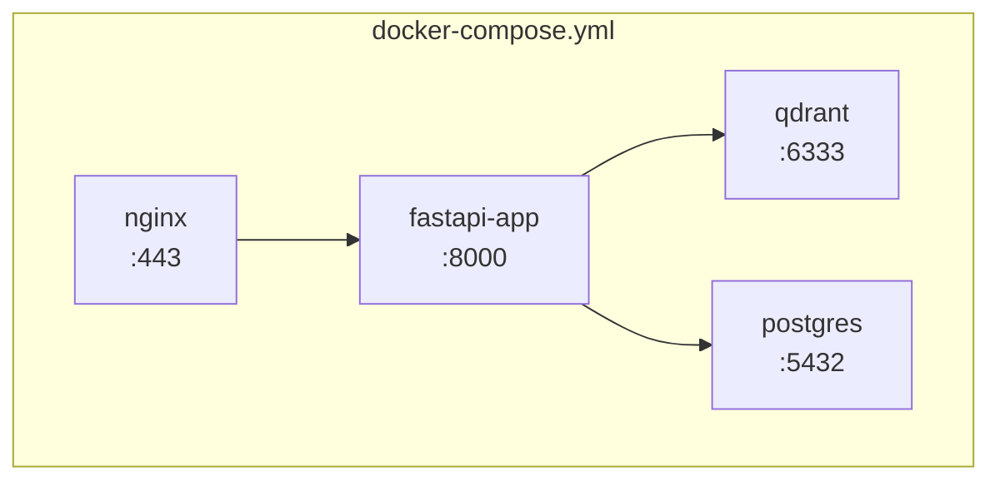

# Arsitektur RAG Chat Assistant — API Only (GPT-4o-mini)

> Dokumen desain infrastruktur & arsitektur untuk fitur chat assistant berbasis RAG,
> dengan LLM via API (GPT-4o-mini) dan kontrol akses per-role di level metadata.
>
> Status: **Blueprint / Desain** — bukan kode implementasi.
> Kurs referensi biaya: **Rp17.943,66 / USD** (perlu diverifikasi ulang saat eksekusi).
> Semua angka biaya adalah **estimasi perencanaan**, bukan harga resmi.

---

## 1. Ringkasan Eksekutif

Sistem chat assistant yang menjawab pertanyaan user berdasarkan dokumen internal
(kebijakan, SOP, dsb.) menggunakan pola **RAG (Retrieval-Augmented Generation)**.

Keputusan arsitektur utama:

| Aspek | Pilihan | Alasan |
|-------|---------|--------|
| LLM | **GPT-4o-mini via API** | Murah, cepat, concurrency ditangani provider, tanpa GPU |
| Embedding | **Lokal (sentence-transformers)** | Gratis, jaga privasi, hemat biaya API |
| Vector DB | **Qdrant** (self-host Docker) | Cepat, gratis, mendukung filter metadata untuk role |
| Backend | **FastAPI** | Standar layanan AI Python, async, cepat |
| Gateway | **Telegram** (via webhook) | Kanal chat user |
| Access control | **Metadata `allowed_roles` di tiap chunk** | Filter di level retrieval, dokumen rahasia tak bocor |
| Deploy | **Docker Compose + Nginx** | Konsisten, mudah kelola, HTTPS |

**Biaya estimasi:** ~Rp2–5 juta/bulan (server + API), **modal awal Rp0**.

---

## 2. Diagram Arsitektur

### 2.1 Arsitektur Tingkat Tinggi



### 2.2 Alur Query (Runtime) — Detail



### 2.3 Alur Ingestion (Memasukkan Dokumen Baru)



---

## 3. Komponen Sistem

### 3.1 Nginx (Reverse Proxy)
- Terminasi HTTPS/SSL (wajib untuk webhook Telegram).
- Meneruskan trafik ke FastAPI.
- Rate limiting dasar & sembunyikan aplikasi dari akses langsung.

### 3.2 FastAPI (Orkestrator RAG)
Jantung aplikasi. Tanggung jawab:
- Menerima webhook Telegram.
- **Autentikasi & otorisasi** user (ambil role dari PostgreSQL).
- Mengelola riwayat percakapan (dibatasi, lihat §6).
- Memanggil embedding lokal, Qdrant (dengan filter role), dan OpenAI.
- Menyusun prompt & mengembalikan jawaban.
- Endpoint terpisah untuk **ingestion** & **manajemen metadata/role**.

### 3.3 Embedding Lokal (sentence-transformers)
- Model contoh: `sentence-transformers/all-MiniLM-L6-v2` (ringan) atau
  `intfloat/multilingual-e5-base` (lebih baik untuk Bahasa Indonesia).
- **Aturan wajib:** model embedding untuk ingestion dan query **harus sama**.

### 3.4 Qdrant (Vector Database)
- Menyimpan vektor + teks + metadata tiap chunk.
- Mendukung **filter metadata** saat search → inti access control per-role.
- Jalan sebagai container Docker, data di-persist ke volume.

### 3.5 PostgreSQL (User & Role)
- Menyimpan pemetaan `telegram_id → user → role(s)`.
- Sumber kebenaran untuk otorisasi (bukan input dari client).

### 3.6 OpenAI API (GPT-4o-mini)
- Hanya untuk **generation** (merangkai jawaban dari konteks).
- API key disimpan sebagai **environment variable / secret**, tidak di kode.

---

## 4. Model Data & Metadata (Inti Access Control)

### 4.1 Struktur Chunk di Qdrant

Setiap chunk (point) di Qdrant terdiri dari:

```json
{
  "id": "uuid-chunk",
  "vector": [0.12, -0.03, "..."],
  "payload": {
    "doc_id": "kebijakan-gaji-2026",
    "judul": "Kebijakan Kenaikan Gaji 2026",
    "teks": "Karyawan tetap berhak atas kenaikan gaji tahunan...",
    "halaman": 3,
    "tanggal_upload": "2026-09-28",
    "versi": 1,
    "departemen": "hr",
    "allowed_roles": ["hr", "manager"]
  }
}
```

Field kunci untuk access control: **`allowed_roles`** (list, fleksibel & bisa diedit).

### 4.2 Skema Role (contoh)

| Role | Deskripsi | Contoh akses |
|------|-----------|--------------|
| `staff` | Karyawan umum | SOP umum, FAQ |
| `hr` | Tim HR | + kebijakan gaji, data cuti |
| `manager` | Manajer | + laporan tim, kebijakan strategis |
| `admin` | Administrator sistem | semua + kelola dokumen |

> Prinsip: `allowed_roles` disimpan sebagai **list** agar 1 dokumen bisa diakses
> banyak role, dan penambahan role baru cukup update payload (tanpa re-embedding).

### 4.3 Tabel User (PostgreSQL)

```
users
├── id (PK)
├── telegram_id (unik)
├── nama
├── roles (array: ["manager"])
├── aktif (boolean)
└── dibuat_pada
```

---

## 5. Manajemen Akses per-Role (Skenario Kunci)

### 5.1 Filter saat Query (Retrieval-time)

Dokumen rahasia **tidak pernah sampai ke LLM** untuk role yang tak berhak,
karena difilter di level Qdrant sebelum retrieval:

```
Query Qdrant:
  vector = embed(pertanyaan)
  filter = { must: [ { key: "allowed_roles", match: { value: <role_user> } } ] }
  limit  = k (mis. 3)
```

### 5.2 Menambah Role Akses ke Dokumen yang Sudah Ada

Skenario: dokumen awalnya hanya `["hr"]`, ingin ditambah `manager`.
**Tidak perlu upload ulang atau re-embedding** — cukup update payload:

```
set_payload(
  collection = "dokumen",
  payload    = { "allowed_roles": ["hr", "manager"] },
  filter     = { doc_id == "kebijakan-gaji-2026" }   # semua chunk dokumen ini
)
```

Vektor tidak tersentuh → operasi ringan & instan.

### 5.3 Trust Boundary (WAJIB)

```
User Telegram → FastAPI verifikasi role dari PostgreSQL → baru buat filter Qdrant
```

- Role **tidak boleh** diambil dari input client mentah.
- Selalu resolve `telegram_id → role` dari database tepercaya di sisi server.

---

## 6. Optimasi Biaya Token (Pelajaran Penting)

Masalah umum: token membengkak karena riwayat percakapan menumpuk. Mitigasi wajib:

| Strategi | Aksi | Dampak |
|----------|------|--------|
| Batasi riwayat | Kirim hanya 3–5 pesan terakhir ke LLM | Hemat 60–80% |
| Ringkas histori | Ganti histori lama dengan ringkasan 1–2 kalimat | Hemat besar di chat panjang |
| Batasi `k` | Ambil 3–4 chunk, bukan 8–10 | Kurangi token konteks |
| Chunk ringkas | 500–800 karakter/chunk | Konteks tak berlebihan |
| Batasi output | Set `max_tokens` jawaban | Cegah jawaban ngelantur |
| Auto-reset | Reset percakapan setelah idle X menit | Cegah akumulasi |
| Logging token | Catat token in/out per request | Deteksi kebocoran dini |

> **Prioritas #1 sebelum go-live:** pasang logging token per request untuk memantau biaya asli.

---

## 7. Spesifikasi Infrastruktur (Server)

### 7.1 Spek Ubuntu Server (API-only, tanpa GPU)

| Komponen | Rekomendasi |
|----------|-------------|
| OS | Ubuntu Server 22.04 LTS |
| CPU | 4 vCPU (embedding lokal butuh CPU) |
| RAM | 16 GB |
| Storage | 80 GB SSD (dokumen + index Qdrant) |
| GPU | Tidak perlu |
| Jaringan | Stabil (panggil OpenAI API) |

### 7.2 Estimasi Biaya (kurs Rp17.943,66)

| Item | USD/bulan | Rupiah/bulan |
|------|-----------|--------------|
| VPS 4 vCPU / 16GB | ~$50 | ~Rp897.000 |
| OpenAI API (5.000 tanya/hari) | ~$75–110 | ~Rp1,35–1,97 juta |
| OpenAI API (10.000 tanya/hari) | ~$150–220 | ~Rp2,69–3,95 juta |

**Total: ~Rp2,25–4,85 juta/bulan. Modal awal: Rp0.**

### 7.3 Estimasi Response Time

| Tahap | Waktu |
|-------|-------|
| Embedding query (lokal, CPU) | ~200–500 ms |
| Vector search (Qdrant) | ~10–50 ms |
| LLM (GPT-4o-mini) | ~1–2,5 detik |
| **Total per pertanyaan** | **~2–3 detik** |

Concurrency 50–100 user ditangani baik karena beban LLM ada di sisi OpenAI.

---

## 8. Deployment (Docker Compose)

Struktur layanan yang dijalankan bersama:



Prinsip deploy:
- Tiap komponen = satu container.
- Data Qdrant & PostgreSQL di-persist ke named volume (jangan hilang saat restart).
- Secret (API key, DB password) via environment/`.env` yang **tidak** masuk git.
- Nginx meng-handle SSL (mis. via Let's Encrypt / Certbot).

---

## 9. Alur Ingestion Dokumen (Detail)

Langkah memasukkan informasi baru (bukan "training", tapi **indexing**):

1. **Upload** — Admin kirim dokumen (PDF/DOCX/TXT) + tentukan `allowed_roles`.
2. **Ekstrak teks** — `pypdf`/`PyMuPDF`; jika PDF hasil scan → **OCR** (Tesseract).
3. **Chunking** — potong 500–800 karakter, overlap ~50–100.
4. **Embedding** — vektorisasi tiap chunk (model lokal yang sama dengan query).
5. **Store** — simpan ke Qdrant dengan payload metadata lengkap (`doc_id`, `allowed_roles`, dst.).

Operasi manajemen dokumen:
- **Update dokumen:** hapus chunk lama by `doc_id`, ingest versi baru (naikkan `versi`).
- **Hapus dokumen:** delete semua chunk by `doc_id`.
- **Ubah akses role:** `set_payload` pada `allowed_roles` (tanpa re-embedding).
- **Deduplikasi:** cek hash/`doc_id` agar tidak dobel.

> Ingestion dijalankan **terpisah** dari alur chat agar query user tetap cepat.

---

## 10. Keamanan & Praktik Baik

- **Trust boundary:** otorisasi role selalu di server (PostgreSQL), bukan client.
- **Secret management:** API key & password via env/secret store, tidak di repo.
- **HTTPS:** wajib untuk webhook Telegram (Nginx + SSL).
- **Validasi input:** sanitasi pesan user sebelum diproses.
- **Least privilege:** user hanya mengakses dokumen sesuai role-nya.
- **Audit log:** catat siapa mengakses/meng-ingest dokumen apa (opsional tapi disarankan).
- **Backup:** snapshot berkala Qdrant & PostgreSQL.
- **Tampilkan sumber:** sertakan referensi dokumen di jawaban untuk mengurangi halusinasi & memudahkan verifikasi.

---

## 11. Rekomendasi Stack Final

| Lapisan | Pilihan |
|---------|---------|
| Framework RAG | LlamaIndex atau LangChain |
| Embedding | sentence-transformers (`multilingual-e5-base` untuk Bahasa Indonesia) |
| Vector DB | Qdrant |
| Auth store | PostgreSQL |
| Backend API | FastAPI |
| LLM | OpenAI GPT-4o-mini |
| Gateway | Telegram (webhook) |
| Reverse proxy | Nginx + SSL |
| Deploy | Docker Compose |

---

## 12. Roadmap Implementasi (Saran Urutan)

1. **Fase 0 — Persiapan:** siapkan VPS Ubuntu, Docker, domain + SSL.
2. **Fase 1 — Core RAG:** Qdrant + embedding lokal + ingestion 1 dokumen uji.
3. **Fase 2 — API & LLM:** FastAPI + integrasi GPT-4o-mini, uji query dasar.
4. **Fase 3 — Auth & Role:** PostgreSQL + filter `allowed_roles` di query.
5. **Fase 4 — Gateway:** integrasi webhook Telegram.
6. **Fase 5 — Optimasi token:** batasi riwayat, logging token, auto-reset.
7. **Fase 6 — Manajemen dokumen:** endpoint upload, update role, hapus versi.
8. **Fase 7 — Hardening:** backup, audit log, rate limit, monitoring.

---

## Catatan Penutup

- Semua biaya adalah **estimasi perencanaan** pada kurs Rp17.943,66 — verifikasi
  pricing resmi OpenAI, harga VPS, dan kurs aktual saat eksekusi.
- Kualitas jawaban RAG lebih ditentukan oleh **kualitas retrieval & data**
  daripada ukuran model — GPT-4o-mini sudah memadai untuk mayoritas kasus.
- Prioritaskan **optimasi token** sejak awal untuk menghindari biaya membengkak.
