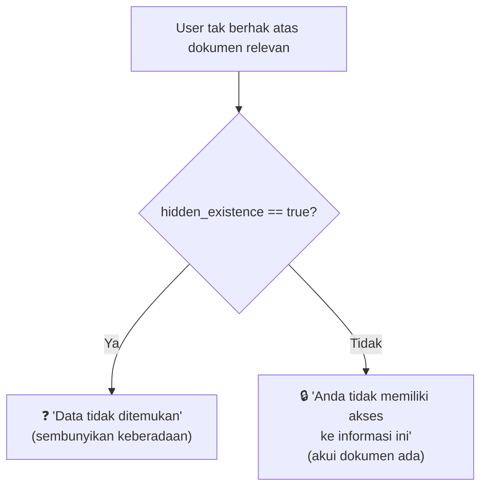
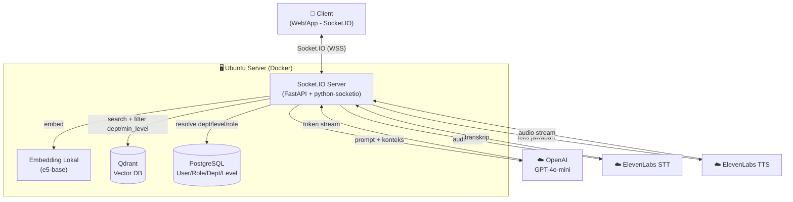
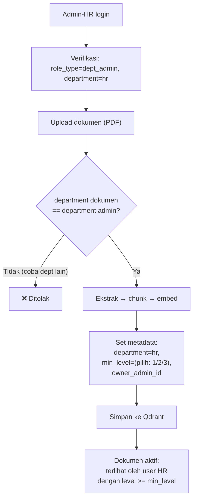
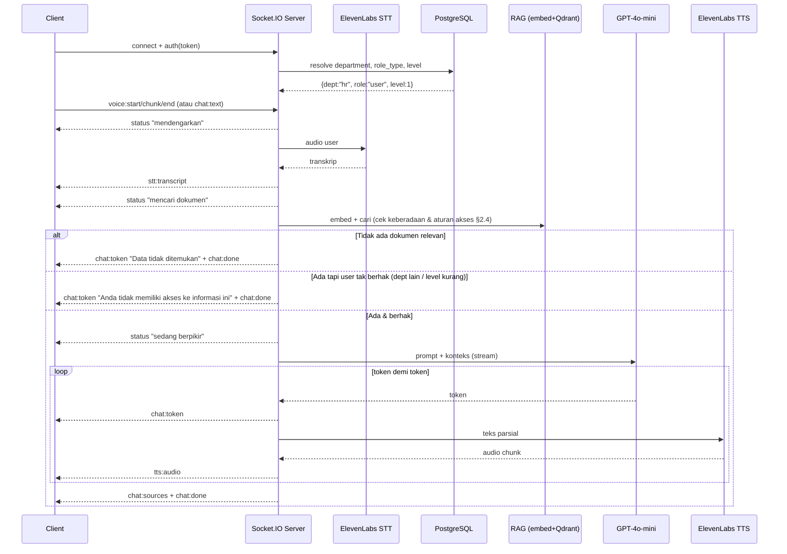

# Desain Fitur: Chat Assistant RAG Real-Time (Suara + Teks) dengan Access Control Multi-Departemen

> Dokumen desain fitur chat assistant berbasis RAG dengan komunikasi **real-time**
> (Socket.IO), integrasi **suara** (STT + TTS via ElevenLabs), dan
> **access control multi-departemen berbasis hierarki level jabatan**.
>
> **Scope saat ini:** tanpa Telegram (di-takeout), tanpa implementasi kode — desain saja.
> Status: **Blueprint / Desain**
> Dokumen terkait: `arsitektur-rag-chat-assistant.md` (infrastruktur & biaya umum)

---

## 1. Goal Fitur

Chat assistant real-time yang:

1. Mengenali **departemen**, **tipe peran**, dan **level jabatan** user (dari login, sumber: PostgreSQL).
2. Menerima pertanyaan via **teks atau suara** (STT).
3. Menjawab **hanya dari dokumen yang boleh diakses user** (sesuai departemen + level), dengan status real-time, jawaban teks mengalir, dan jawaban suara (TTS).
4. Membedakan tiga kondisi respons secara tegas:

| Kondisi | Respons |
|---------|---------|
| Dokumen relevan **ada** & user **berhak** | ✅ Jawaban dari dokumen (+ sumber) |
| Dokumen relevan **ada** tapi user **tidak berhak** | 🔒 "Anda tidak memiliki akses ke informasi ini" |
| **Tidak ada** dokumen relevan | ❓ "Data tidak ditemukan" |

---

## 2. Model Akses: Departemen + Hierarki Level Jabatan

Akses ditentukan **dua dimensi**:

1. **Departemen** — dokumen milik departemen mana (HR, Finance, Legal, dst.).
2. **Level jabatan** — hierarki angka; makin tinggi, makin banyak akses.

### 2.1 Tipe Peran (`role_type`)

| role_type | Wewenang |
|-----------|----------|
| `super_admin` | Kelola & baca **semua** departemen (lintas dept) |
| `dept_admin` | Upload/kelola/assign & baca dokumen **departemennya saja** |
| `user` | Baca dokumen departemennya sesuai **level jabatan** |

### 2.2 Level Jabatan (`level`)

| Level | Jabatan (default) | Angka |
|-------|-------------------|-------|
| Dasar | Staff | 1 |
| Menengah | Supervisor / Senior | 2 |
| Tertinggi | Manager / Kepala Dept | 3 |

> Daftar level dapat diperluas (mis. tambah Direktur=4) tanpa mengubah logika.

### 2.3 Level Minimal Dokumen (`min_level`)

Tiap dokumen diberi **level minimal** untuk membacanya:
- "SOP Umum HR" → `min_level: 1` (semua HR bisa baca)
- "Rahasia Gaji HR" → `min_level: 3` (hanya Manager HR)

### 2.4 Aturan Akses Baca (Inti)

```
User boleh BACA dokumen jika salah satu benar:

1. role_type == "super_admin"
      → semua dokumen (tanpa batas)

2. role_type == "dept_admin"
      → dokumen.department == user.department
        (admin dept lihat SEMUA dokumen departemennya, abaikan min_level)

3. role_type == "user"
      → dokumen.department == user.department
        DAN user.level >= dokumen.min_level
```

**Konsekuensi yang diinginkan:**
- **Manager** (level 3) lolos semua `min_level` di **departemennya** → "manager lihat semua dokumen dept-nya".
- **Staff** (level 1) hanya lolos dokumen ber-`min_level` rendah → "staff tidak semua dokumen".
- Batas **departemen tetap tegas** — akses lintas-dept hanya `super_admin`.

---

## 3. Wewenang Kelola (Admin Berjenjang)

| Aksi | super_admin | dept_admin (mis. HR) | user |
|------|-------------|----------------------|------|
| Upload dokumen ke dept-nya | ✅ (dept mana pun) | ✅ (HR saja) | ❌ |
| Upload dokumen ke dept lain | ✅ | ❌ | ❌ |
| Set `min_level` dokumen | ✅ | ✅ (dept-nya) | ❌ |
| Assign dokumen ke level user di dept-nya | ✅ | ✅ (HR saja) | ❌ |
| Buat dokumen lintas-departemen | ✅ | ❌ | ❌ |
| Kelola user di dept-nya | ✅ | ✅ | ❌ |
| Baca dokumen dept lain | ✅ | ❌ | ❌ |

> "Assign ke user" = mengatur `min_level` dokumen sehingga terlihat oleh level jabatan tertentu ke atas di departemen itu. Tidak ada assignment per-user-spesifik (disederhanakan sesuai keputusan).

---

## 4. Model Data

### 4.1 User (PostgreSQL)

```
users
├── id (PK)
├── username / email (unik)
├── password_hash
├── department      ("hr" | "finance" | ... | null untuk super_admin)
├── role_type       ("super_admin" | "dept_admin" | "user")
├── level           (1=staff | 2=supervisor | 3=manager)
├── aktif (boolean)
└── dibuat_pada
```

Tabel pendukung (opsional, untuk fleksibilitas):
```
departments        (id, kode, nama)
levels             (angka, nama_jabatan)   # kamus level → jabatan
```

### 4.2 Chunk Dokumen (Qdrant)

```json
{
  "id": "uuid-chunk",
  "vector": [0.12, -0.03, "..."],
  "payload": {
    "doc_id": "kebijakan-gaji-2026",
    "judul": "Kebijakan Kenaikan Gaji 2026",
    "teks": "Karyawan tetap berhak atas kenaikan gaji tahunan...",
    "department": "hr",
    "min_level": 3,
    "hidden_existence": false,
    "owner_admin_id": "user_45",
    "halaman": 3,
    "tanggal_upload": "2026-09-28",
    "versi": 1
  }
}
```

Field kunci access control: **`department`** + **`min_level`** (keduanya bisa diedit tanpa re-embedding).

---

## 5. Matriks Contoh Akses Baca

Departemen HR punya 2 dokumen: "SOP Umum HR" (`min_level: 1`), "Rahasia Gaji HR" (`min_level: 3`).

| User | Dept | Level / role | SOP Umum HR | Rahasia Gaji HR | Dokumen Finance |
|------|------|--------------|-------------|-----------------|-----------------|
| Super-admin | — | super_admin | ✅ | ✅ | ✅ |
| Admin-HR | hr | dept_admin | ✅ | ✅ | ❌ |
| Manager HR | hr | user, lvl 3 | ✅ | ✅ | ❌ |
| Staff HR | hr | user, lvl 1 | ✅ | ❌ (level kurang) | ❌ |
| Manager Finance | finance | user, lvl 3 | ❌ (beda dept) | ❌ (beda dept) | ✅ |

---

## 6. Dampak ke Chat 3-Kondisi (+ Flag Sembunyikan Keberadaan)

Logika chat memakai aturan §2.4, ditambah flag `hidden_existence` (§6.2).

| Situasi | Hasil |
|---------|-------|
| Tak ada dokumen relevan di dept mana pun | ❓ "Data tidak ditemukan" |
| Dokumen relevan ADA, user tak berhak, `hidden_existence=false` | 🔒 "Anda tidak memiliki akses ke informasi ini" |
| Dokumen relevan ADA, user tak berhak, `hidden_existence=true` | ❓ "Data tidak ditemukan" (keberadaan disembunyikan) |
| Dokumen relevan ada & user berhak | ✅ Jawab dari dokumen |

Contoh: **Staff HR** tanya "rahasia gaji" → dokumen ada (`min_level 3`) tapi level staff (1) kurang → 🔒 "tidak memiliki akses" (bukan "tidak ditemukan").

### 6.2 Flag `hidden_existence` — Menyembunyikan Keberadaan Dokumen

Untuk dokumen **super rahasia** yang keberadaannya pun harus disembunyikan
(mis. rencana PHK, akuisisi rahasia, investigasi internal). Flag ini mengubah
**pesan** yang diterima user tak berhak:

- `hidden_existence: false` (default) → user tak berhak dapat 🔒 "tidak memiliki akses" (tahu dokumen *ada*).
- `hidden_existence: true` → user tak berhak dapat ❓ "data tidak ditemukan" (seolah dokumen *tidak ada*).

**Logika keputusan (saat user tak berhak atas dokumen relevan):**



**Contoh — 3 dokumen HR, respons untuk Staff HR (level 1):**

| Dokumen | min_level | hidden_existence | Respons ke Staff HR |
|---------|-----------|------------------|---------------------|
| SOP Umum HR | 1 | false | ✅ Jawaban |
| Rahasia Gaji HR | 3 | false | 🔒 "Tidak memiliki akses" |
| Rencana PHK Rahasia | 3 | **true** | ❓ "Data tidak ditemukan" (disembunyikan total) |

**Siapa yang set:** admin saat upload/edit (dept_admin untuk dept-nya, super_admin untuk semua).
**Default:** `false` — gunakan `true` hanya untuk dokumen yang keberadaannya sensitif,
karena "tidak memiliki akses" lebih ramah (user tahu dokumen ada & bisa minta akses ke admin).

Contoh metadata:
```json
{
  "payload": {
    "doc_id": "rencana-phk-2026",
    "judul": "Rencana Restrukturisasi & PHK 2026",
    "department": "hr",
    "min_level": 3,
    "hidden_existence": true
  }
}
```

### 6.1 Cara Menentukan (Retrieval)

1. **Cari kandidat relevan** (embed + Qdrant + score threshold) — untuk tahu dokumen relevan *ada* atau tidak.
2. **Terapkan aturan akses §2.4** pada kandidat teratas:
   - Tak ada kandidat relevan → "data tidak ditemukan".
   - Ada, user berhak → jawab (pakai chunk yang boleh diakses).
   - Ada, user tak berhak → "tidak memiliki akses".

Implementasi bisa via filter langsung di Qdrant (`department` + `min_level`) untuk jalur "berhak", plus satu cek tanpa filter untuk membedakan "tidak ditemukan" vs "tidak berhak". Metode final ditentukan saat implementasi (perilaku sama).

---

## 7. Protokol Komunikasi: Socket.IO

Real-time dua arah (dipilih karena kebutuhan suara & status real-time; auto-reconnect & fallback bawaan). WebSocket murni = alternatif fungsional-setara.

### 7.1 Event Client → Server
| Event | Payload | Keterangan |
|-------|---------|------------|
| `auth` | `{ token }` | Autentikasi sesi saat koneksi |
| `chat:text` | `{ pertanyaan }` | Pertanyaan teks |
| `voice:start` / `voice:chunk` / `voice:end` | audio | Sesi bicara (STT) |
| `chat:cancel` | `{}` | Batalkan pemrosesan |

### 7.2 Event Server → Client
| Event | Payload | Keterangan |
|-------|---------|------------|
| `stt:transcript` | `{ teks }` | Transkrip suara user |
| `status` | `{ tahap }` | "mendengarkan"/"mencari dokumen"/"sedang berpikir" |
| `chat:token` | `{ token }` | Jawaban teks (streaming) |
| `chat:sources` | `{ dokumen[] }` | Sumber jawaban |
| `tts:audio` | `{ audio_chunk/url }` | Audio jawaban (TTS streaming) |
| `chat:done` | `{}` | Selesai |
| `error` | `{ kode, pesan }` | Kesalahan |

---

## 8. Arsitektur Sistem



---

## 9. Alur Upload & Assign oleh Admin Departemen



"Assign ke user" = admin menetapkan `min_level` dokumen → otomatis terlihat oleh semua user departemen itu yang levelnya memenuhi.

---

## 10. Alur Chat End-to-End (Suara + Teks + Akses)



---

## 11. Integrasi Suara (ElevenLabs)

- **STT:** audio user (via `voice:chunk`) → ElevenLabs STT → transkrip → masuk alur RAG.
- **TTS:** teks jawaban → ElevenLabs TTS (streaming) → audio dialirkan ke client.
- **Konsekuensi:** biaya terpisah (TTS per karakter, STT per menit), latency tambahan, audio user dikirim ke pihak ketiga (privasi), API key baru dikelola aman.

---

## 12. Pengaman Anti-Halusinasi

- **Lapis 1 (utama):** retrieval kosong / user tak berhak → pesan standar **tanpa memanggil LLM**.
- **Lapis 2 (jaring):** prompt tegas — "jawab HANYA dari konteks; jika tak ada, jawab 'Data tidak ditemukan'; jangan menambah pengetahuan sendiri."

---

## 12A. Tone, Persona & Emosi Respons

Asisten diberi **tone** yang konsisten agar UX hangat, tanpa mengubah fakta.

### 12A.1 Tone Teks (via system prompt)
- **Default: profesional–hangat** — sopan, jelas, ramah, tidak kaku.
- **Bahasa:** jawaban **mengikuti bahasa pertanyaan** user (mis. pertanyaan Inggris → jawab Inggris). Voice TTS menyesuaikan bahasa bila memungkinkan.
- **Batas keras:** tone hanya menghias *cara menyampaikan*, **tidak boleh mengubah/menambah fakta**. Aturan "jawab hanya dari konteks" tetap mutlak (§12).
- **Persona:** netral tanpa nama (default). Dapat diberi nama/kepribadian bila diinginkan (→ §16).

Contoh arahan tone di system prompt:
```
Jawablah dengan sopan, hangat, dan ringkas. Bersikap membantu dan tidak menggurui.
Tone hanya memengaruhi gaya bahasa — JANGAN menambah informasi di luar KONTEKS.
```

### 12A.2 Tone Pesan Penolakan (konsisten & tidak menghakimi)
Pesan "tidak memiliki akses" / "data tidak ditemukan" tetap **sopan & netral**,
tidak dingin dan tidak minta maaf berlebihan. **Pesan penolakan JUGA disuarakan (TTS)**
dengan nada sopan-tenang (lihat §12A.3). Contoh:
- 🔒 "Maaf, informasi ini berada di luar hak akses Anda. Silakan hubungi admin bila memerlukannya."
- ❓ "Maaf, saya tidak menemukan informasi terkait pertanyaan Anda."

### 12A.3 Emosi Suara (TTS ElevenLabs) — Ekspresif Dinamis
Voice **natural & ramah** dengan **ekspresivitas dinamis**: nada menyesuaikan konteks respons.

Pemetaan konteks → emosi suara (contoh):

| Konteks respons | Nada suara |
|-----------------|-----------|
| Jawaban normal dari dokumen | Hangat, jelas, ramah |
| Pesan "tidak memiliki akses" | Sopan, tenang, sedikit lebih serius |
| Pesan "data tidak ditemukan" | Netral, membantu |
| Status ("sedang berpikir", dll.) | Ringan, singkat |

**Cara kerja:** sistem menentukan "label emosi" untuk tiap respons (berdasarkan jenis
respons: jawaban / penolakan / tidak-ditemukan), lalu memetakannya ke parameter
ekspresivitas voice ElevenLabs.

**Implikasi (catatan):**
- Menambah sedikit logika: penentuan label emosi + pemetaan ke parameter TTS.
- Model/voice ekspresif ElevenLabs umumnya **lebih mahal** & bisa menambah sedikit latency.
- Perlu kalibrasi agar ekspresi terasa natural, tidak berlebihan (konteks korporat).
- Verifikasi dukungan emosi pada voice/model ElevenLabs yang dipilih saat implementasi.

---

## 13. Estimasi Biaya (kurs Rp17.943,66 — estimasi perencanaan)

| Sumber | Basis | Catatan |
|--------|-------|---------|
| VPS Ubuntu (4 vCPU/16GB) | ~Rp897rb/bln | Tanpa GPU |
| OpenAI GPT-4o-mini | per token | ~Rp1,3–4 juta/bln (tergantung volume) |
| ElevenLabs TTS | per karakter | Bergantung durasi jawaban suara |
| ElevenLabs STT | per menit audio | Bergantung durasi bicara user |

> ⚠️ Verifikasi harga resmi OpenAI & ElevenLabs saat eksekusi. **Tanpa batas panjang jawaban suara** (sesuai keputusan) berarti jawaban panjang = lebih banyak karakter TTS = biaya lebih tinggi; **suara ekspresif dinamis** juga umumnya lebih mahal. Pantau biaya TTS secara berkala.

---

## 14. Pertimbangan Keamanan

- **Trust boundary:** `department`, `role_type`, `level` selalu di-resolve dari PostgreSQL (sesi terautentikasi), tak pernah dari input client.
- **Guard upload:** dept_admin hanya boleh upload/kelola dokumen `department`-nya sendiri (validasi server-side wajib).
- **Batas departemen:** user & dept_admin tidak pernah menerima chunk dari departemen lain.
- **Batas level:** user tidak menerima chunk ber-`min_level` di atas levelnya.
- **Kebocoran keberadaan dokumen:** membedakan "tidak berhak" vs "tidak ditemukan" membuat user tahu suatu dokumen *ada*. Untuk dokumen sangat rahasia, sediakan opsi `hidden_existence` (→ §16).
- **Secret & rate limit & audit log:** kelola API key aman, batasi frekuensi, catat akses (allowed/denied) + siapa upload/ubah `min_level`.

---

## 15. Ruang Lingkup

**Dalam scope:**
- Login → sesi (JWT) → resolve department/role_type/level dari PostgreSQL.
- Server Socket.IO (FastAPI + python-socketio) + event §7.
- Manajemen admin berjenjang (super_admin, dept_admin) — upload & set `min_level`.
- Ingestion dokumen per departemen + metadata `department`/`min_level`.
- Vector store (Qdrant) + embedding lokal.
- Logika akses §2.4 + 3-kondisi + score threshold.
- Streaming jawaban + status real-time.
- STT & TTS via ElevenLabs.
- Anti-halusinasi + data uji (seed user/dept/level & dokumen).

**Di luar scope saat ini (takeout / nanti):**
- Telegram gateway.
- Assignment per-user-spesifik (dihapus sesuai keputusan; pakai level).
- Nginx/SSL produksi (produksi perlu WSS).
- Redis cache.
- Frontend UI final.

---

## 16. Pertanyaan Terbuka & Asumsi

**Pertanyaan terbuka (tersisa):**

1. **Kalibrasi retrieval:** nilai awal `k=4` & `score threshold=0.7` — **dikalibrasi saat uji** dengan pertanyaan & dokumen asli (bukan keputusan final di awal).

**Ditunda (skip untuk sekarang, ditambah nanti):**

- **Level tambahan** (Direktur, Kepala Divisi) — kemungkinan ada, ditunda. Struktur `level` (angka) sudah siap diperluas tanpa ubah logika.
- **User lintas departemen** (satu user di >1 dept) — ditunda. Saat ini **1 user = 1 departemen**.

**Keputusan final (dikonfirmasi):**
- Manager melihat semua dokumen **departemennya saja** (bukan lintas dept). ✅
- Model akses **level hierarki** (bukan daftar title eksplisit). ✅
- Flag **`hidden_existence`** diadopsi untuk dokumen super rahasia. ✅
- **dept_admin tidak dapat mengakses departemen lain.** ✅
- **dept_admin BOLEH mengelola user di departemennya** (buat/nonaktifkan). ✅
- **Persona netral** tanpa nama; tone teks profesional–hangat. ✅
- **Suara ekspresif dinamis** (nada menyesuaikan konteks). ✅
- **Login internal** (username/password), bukan SSO. ✅
- **Pesan penolakan & "tidak ditemukan" JUGA disuarakan (TTS).** ✅
- **Tanpa batas panjang jawaban suara** (⚠️ catat: berpotensi menambah biaya TTS — lihat §13). ✅
- **Bahasa jawaban mengikuti bahasa pertanyaan** user. ✅

**Asumsi teknis (sampai dikoreksi):**
- Satu user = satu departemen, satu level.
- Akses berjenjang: level lebih tinggi selalu bisa membaca dokumen level lebih rendah (di dept sama).
- Satu koleksi Qdrant untuk semua dokumen (pemisahan via metadata `department`).
- Suara bersifat opsional (user tetap bisa full teks).
- Tone default: **profesional–hangat**, netral tanpa persona.

---

## 17. Kriteria Verifikasi (Definition of Done)

Data uji:
- Dept HR: "SOP Umum HR" (`min_level 1`), "Rahasia Gaji HR" (`min_level 3`)
- Dept Finance: "Laporan Keuangan" (`min_level 2`)
- User: Super-admin; Admin-HR; Manager HR (lvl3); Staff HR (lvl1); Manager Finance (lvl3)

| User | Pertanyaan | Hasil diharapkan |
|------|-----------|-------------------|
| Staff HR | "Apa isi SOP umum HR?" | ✅ Jawaban SOP Umum HR |
| Staff HR | "Berapa rahasia gaji HR?" | 🔒 "Tidak memiliki akses" (level 1 < min_level 3) |
| Manager HR | "Berapa rahasia gaji HR?" | ✅ Jawaban Rahasia Gaji HR |
| Manager HR | "Isi laporan keuangan?" | 🔒 "Tidak memiliki akses" (beda departemen) |
| Manager Finance | "Isi laporan keuangan?" | ✅ Jawaban Laporan Keuangan |
| Admin-HR | (upload dokumen ke dept Finance) | ❌ Ditolak (bukan departemennya) |
| Super-admin | "Isi laporan keuangan?" | ✅ Jawaban (akses semua) |
| Siapa pun | "Resep rendang?" | ❓ "Data tidak ditemukan" |

Verifikasi real-time & suara:
- Event `status` berurutan; `chat:token` mengalir bertahap; STT & TTS berfungsi; koneksi pulih otomatis.

Fitur **selesai** jika seluruh skenario & verifikasi di atas berperilaku sesuai.

---

## Catatan Penutup

- Model akses **dua dimensi**: departemen (batas tegas) + hierarki level (Staff/Supervisor/Manager).
- Admin berjenjang: **super_admin** (semua dept) & **dept_admin** (dept-nya saja).
- **Flag `hidden_existence`** menyembunyikan keberadaan dokumen super rahasia (user tak berhak dapat "data tidak ditemukan", bukan "tidak memiliki akses").
- **Tone respons** default profesional–hangat (teks) + voice ramah natural (suara), tanpa mengubah fakta.
- Assignment per-user-spesifik dihapus; diganti mekanisme `min_level`.
- Level tambahan & user lintas-departemen **ditunda** (struktur sudah siap diperluas).
- Detail infrastruktur umum ada di `arsitektur-rag-chat-assistant.md`.
- Belum ada kode — tahap berikutnya menunggu jawaban atas §16.
