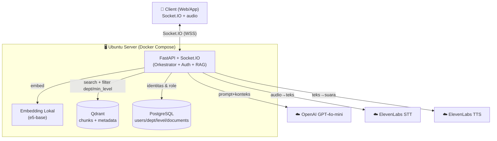
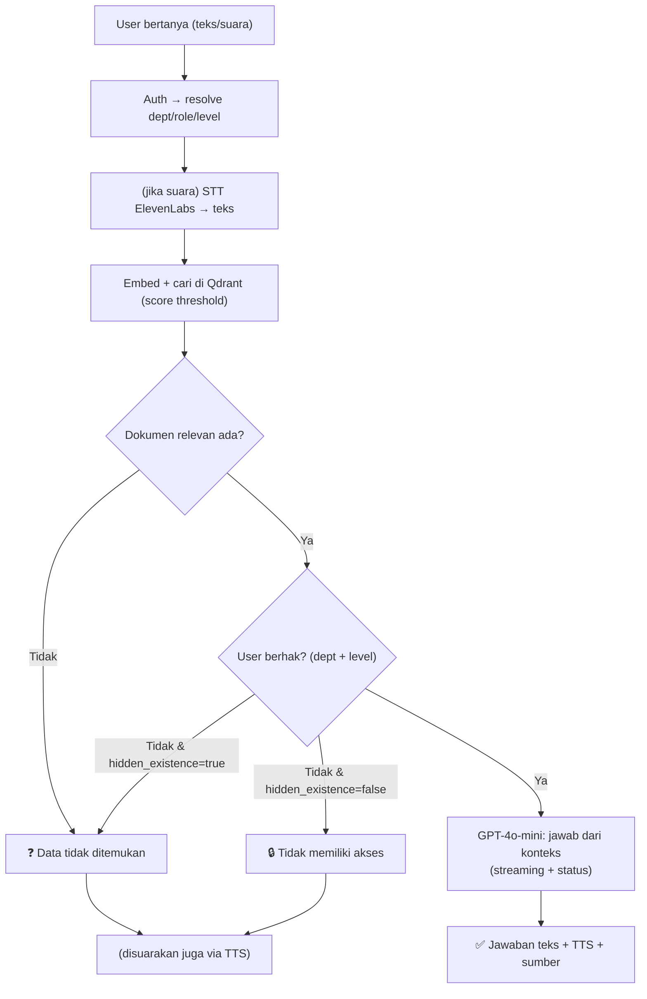

# Ringkasan Arsitektur Final — Chat Assistant RAG

> Dokumen **ikhtisar** (peta) yang menyatukan seluruh keputusan desain sistem
> chat assistant RAG multi-departemen. Baca ini lebih dulu untuk gambaran utuh,
> lalu lanjut ke dokumen detail sesuai kebutuhan.
>
> Status: **Blueprint / Desain** — belum ada implementasi kode.

---

## 1. Peta Dokumen

| Dokumen | Isi |
|---------|-----|
| **Ringkasan Arsitektur Final** (dokumen ini) | Ikhtisar & keputusan kunci |
| `desain-fitur-chat-assistant-rag.md` | Logika fitur, access control, protokol, suara, tone |
| `skema-database-postgresql.md` | Skema tabel PostgreSQL & relasi |
| `arsitektur-rag-chat-assistant.md` | Infrastruktur, biaya, deployment umum |

---

## 2. Ringkasan Sistem (Satu Paragraf)

Chat assistant berbasis **RAG** yang menjawab pertanyaan karyawan **hanya dari dokumen
yang boleh mereka akses** (berdasarkan **departemen** + **level jabatan**). Komunikasi
**real-time** via **Socket.IO** dengan status "sedang berpikir", jawaban teks yang mengalir,
serta **suara** (STT + TTS ekspresif via ElevenLabs). LLM memakai **GPT-4o-mini via API**,
embedding **lokal**, dan **Qdrant** sebagai vector database. Sistem membedakan tiga respons:
**menjawab**, **"tidak memiliki akses"**, atau **"data tidak ditemukan"** — dengan opsi
menyembunyikan keberadaan dokumen super rahasia.

---

## 3. Keputusan Kunci (Terkunci)

### Arsitektur & Teknologi
| Aspek | Keputusan |
|-------|-----------|
| LLM | GPT-4o-mini via API (tanpa GPU lokal) |
| Embedding | Lokal — `multilingual-e5-base` (sentence-transformers) |
| Vector DB | Qdrant (self-host Docker) |
| Auth store | PostgreSQL (login internal username/password) |
| Backend | FastAPI + python-socketio |
| Protokol | **Socket.IO** (real-time dua arah) |
| Suara | ElevenLabs STT + TTS (ekspresif dinamis) |
| Deploy | Docker Compose (+ Nginx/SSL untuk produksi) |
| Gateway Telegram | **Di-takeout** (fokus fitur inti dulu) |

### Access Control
| Aspek | Keputusan |
|-------|-----------|
| Model akses | 2 dimensi: **departemen** + **hierarki level** |
| Level | Staff=1, Supervisor=2, Manager=3 (bisa diperluas) |
| Peran admin | `super_admin` (semua dept) · `dept_admin` (dept sendiri) · `user` |
| Manager | Lihat semua dokumen **departemennya saja** |
| dept_admin | Upload/kelola dokumen **+ kelola user** di dept-nya; tak bisa dept lain |
| Assign dokumen | Via `min_level` (bukan per-user-spesifik) |
| Dokumen rahasia | Flag `hidden_existence` (sembunyikan keberadaan) |

### Perilaku & UX
| Aspek | Keputusan |
|-------|-----------|
| 3 kondisi respons | Jawab / "tidak memiliki akses" / "data tidak ditemukan" |
| Anti-halusinasi | Skip LLM bila konteks kosong + prompt tegas "jawab hanya dari konteks" |
| Persona | Netral (tanpa nama), tone profesional–hangat |
| Suara | Ekspresif dinamis; pesan penolakan juga disuarakan |
| Bahasa jawaban | Mengikuti bahasa pertanyaan |
| Panjang jawaban suara | Tanpa batas (⚠️ pantau biaya TTS) |
| Retrieval awal | `k=4`, score threshold `0.7` (kalibrasi saat uji) |

---

## 4. Diagram Arsitektur Utuh

---

## 5. Alur Ringkas (Sekali Tanya)

---

## 6. Prinsip Keamanan Inti

1. **Trust boundary:** departemen/role/level selalu dari PostgreSQL (sesi terautentikasi), bukan input client.
2. **Batas departemen tegas:** user & dept_admin tak pernah menerima chunk dept lain; hanya super_admin lintas-dept.
3. **Batas level:** user tak menerima chunk ber-`min_level` di atas levelnya.
4. **Anti-halusinasi:** LLM hanya menjawab dari chunk yang boleh diakses; tak ada karangan.
5. **Sembunyikan keberadaan:** flag `hidden_existence` untuk dokumen super rahasia.
6. **Secret & audit:** API key aman (env/secret), audit log akses (allowed/denied).

---

## 7. Status & Langkah Berikutnya

**Sudah diputuskan:** seluruh keputusan kunci di §3 (terkunci).

**Masih terbuka (kalibrasi saat uji):** nilai `k` & score threshold.

**Ditunda (struktur sudah siap):** level tambahan (Direktur/Kepala Divisi), user lintas-departemen.

**Belum dikerjakan:** implementasi kode (menunggu keputusan untuk mulai).

**Urutan implementasi disarankan** (bila lanjut):
1. Infrastruktur dasar (Docker, PostgreSQL, Qdrant).
2. Skema DB + seed data uji (lihat `skema-database-postgresql.md`).
3. Ingestion dokumen + metadata (department/min_level/hidden_existence).
4. Auth login internal + resolusi identitas.
5. Core RAG + logika 3-kondisi + score threshold.
6. Socket.IO real-time (status + streaming jawaban).
7. Integrasi ElevenLabs STT & TTS ekspresif.
8. Panel admin (upload, set min_level, kelola user per dept).
9. Hardening: audit log, rate limit, backup, monitoring biaya token & TTS.

---

## 8. Catatan Biaya (Pengingat)

- **Estimasi bulanan:** VPS ~Rp0,9 juta + OpenAI mini ~Rp1,3–4 juta + **ElevenLabs (variabel)**.
- **Perhatian khusus:** suara **tanpa batas panjang** + **ekspresif dinamis** menaikkan biaya TTS. Pantau sejak awal.
- Semua angka **estimasi perencanaan** (kurs Rp17.943,66) — verifikasi pricing resmi saat eksekusi.

---

*Semua detail lengkap ada di dokumen terkait (§1). Dokumen ini hanya peta ringkas.*
