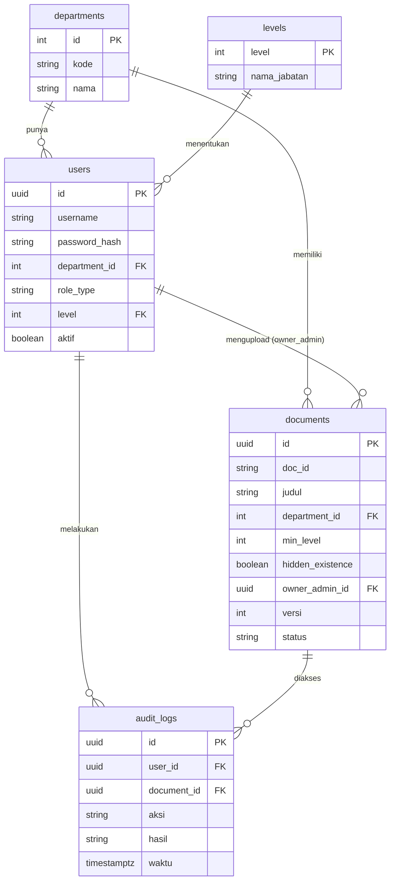
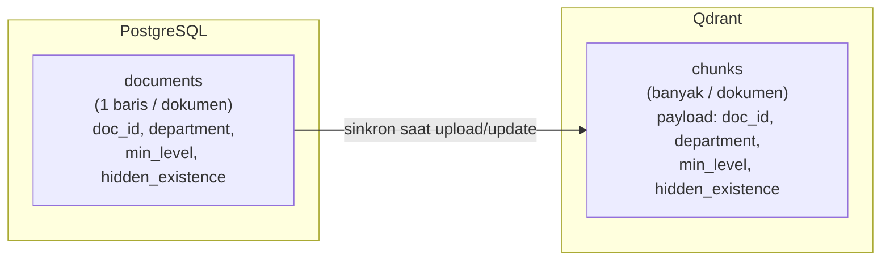

# Skema Database PostgreSQL — Chat Assistant RAG Multi-Departemen

> Dokumen skema database untuk sistem chat assistant RAG dengan access control
> multi-departemen berbasis hierarki level jabatan.
>
> Status: **Blueprint / Desain** — belum diimplementasikan.
> Dokumen terkait:
> - `desain-fitur-chat-assistant-rag.md` (logika fitur & access control)
> - `arsitektur-rag-chat-assistant.md` (infrastruktur & biaya)

---

## 1. Ruang Lingkup Database

PostgreSQL menyimpan **data terstruktur & sumber kebenaran otorisasi**:
- User, departemen, level jabatan.
- Registry dokumen (metadata master; isi vektor tetap di Qdrant).
- Audit log akses.

> Catatan: **vektor & teks chunk disimpan di Qdrant**, bukan PostgreSQL.
> PostgreSQL menyimpan registry dokumen (1 baris per dokumen) untuk manajemen &
> sinkronisasi; Qdrant menyimpan banyak chunk per dokumen untuk pencarian.

---

## 2. Diagram Relasi (ERD)



---

## 3. Definisi Tabel

### 3.1 `departments` — Master Departemen

| Kolom | Tipe | Keterangan |
|-------|------|------------|
| `id` | SERIAL PK | ID departemen |
| `kode` | VARCHAR unik | Kode singkat, mis. `hr`, `finance` |
| `nama` | VARCHAR | Nama lengkap, mis. "Human Resources" |
| `dibuat_pada` | TIMESTAMPTZ | Waktu dibuat |

```sql
CREATE TABLE departments (
    id           SERIAL PRIMARY KEY,
    kode         VARCHAR(50) UNIQUE NOT NULL,
    nama         VARCHAR(150) NOT NULL,
    dibuat_pada  TIMESTAMPTZ NOT NULL DEFAULT now()
);
```

### 3.2 `levels` — Kamus Level Jabatan

Hierarki level (angka lebih besar = akses lebih tinggi). Mudah diperluas
(mis. tambah Direktur=4) tanpa mengubah logika aplikasi.

| Kolom | Tipe | Keterangan |
|-------|------|------------|
| `level` | INT PK | Angka hierarki (1=Staff, 2=Supervisor, 3=Manager) |
| `nama_jabatan` | VARCHAR | Label, mis. "Staff" |

```sql
CREATE TABLE levels (
    level         INT PRIMARY KEY,
    nama_jabatan  VARCHAR(100) NOT NULL
);

INSERT INTO levels (level, nama_jabatan) VALUES
    (1, 'Staff'),
    (2, 'Supervisor'),
    (3, 'Manager');
-- (Direktur/Kepala Divisi ditunda — tinggal INSERT level 4, dst. bila perlu)
```

### 3.3 `users` — User, Peran, Departemen, Level

Sumber kebenaran otorisasi. Login **internal** (username/password).

| Kolom | Tipe | Keterangan |
|-------|------|------------|
| `id` | UUID PK | ID user |
| `username` | VARCHAR unik | Untuk login |
| `password_hash` | VARCHAR | Hash password (mis. bcrypt/argon2) |
| `department_id` | INT FK → departments | NULL untuk `super_admin` |
| `role_type` | VARCHAR | `super_admin` \| `dept_admin` \| `user` |
| `level` | INT FK → levels | Level jabatan (relevan untuk `user`) |
| `aktif` | BOOLEAN | Nonaktifkan tanpa hapus |
| `dibuat_pada` | TIMESTAMPTZ | |
| `diperbarui_pada` | TIMESTAMPTZ | |

```sql
CREATE TABLE users (
    id               UUID PRIMARY KEY DEFAULT gen_random_uuid(),
    username         VARCHAR(100) UNIQUE NOT NULL,
    password_hash    VARCHAR(255) NOT NULL,
    department_id    INT REFERENCES departments(id),
    role_type        VARCHAR(20) NOT NULL
                     CHECK (role_type IN ('super_admin','dept_admin','user')),
    level            INT REFERENCES levels(level),
    aktif            BOOLEAN NOT NULL DEFAULT true,
    dibuat_pada      TIMESTAMPTZ NOT NULL DEFAULT now(),
    diperbarui_pada  TIMESTAMPTZ NOT NULL DEFAULT now(),

    -- super_admin tidak terikat departemen; user/dept_admin wajib punya departemen
    CONSTRAINT chk_dept_role CHECK (
        (role_type = 'super_admin' AND department_id IS NULL)
        OR (role_type IN ('dept_admin','user') AND department_id IS NOT NULL)
    )
);

CREATE INDEX idx_users_department ON users(department_id);
CREATE INDEX idx_users_role ON users(role_type);
```

### 3.4 `documents` — Registry Dokumen (Master)

Satu baris per **dokumen** (bukan per chunk). Metadata otorisasi di sini adalah
sumber kebenaran; disinkronkan ke payload chunk di Qdrant.

| Kolom | Tipe | Keterangan |
|-------|------|------------|
| `id` | UUID PK | ID internal |
| `doc_id` | VARCHAR unik | ID logis dokumen (dipakai sebagai kunci di Qdrant) |
| `judul` | VARCHAR | Judul dokumen |
| `department_id` | INT FK → departments | Departemen pemilik |
| `min_level` | INT | Level minimal untuk membaca |
| `hidden_existence` | BOOLEAN | true = sembunyikan keberadaan dari user tak berhak |
| `owner_admin_id` | UUID FK → users | Admin yang mengupload |
| `versi` | INT | Versi dokumen |
| `status` | VARCHAR | `active` \| `archived` |
| `nama_file` | VARCHAR | Nama file asli |
| `dibuat_pada` / `diperbarui_pada` | TIMESTAMPTZ | |

```sql
CREATE TABLE documents (
    id                UUID PRIMARY KEY DEFAULT gen_random_uuid(),
    doc_id            VARCHAR(150) UNIQUE NOT NULL,
    judul             VARCHAR(255) NOT NULL,
    department_id     INT NOT NULL REFERENCES departments(id),
    min_level         INT NOT NULL DEFAULT 1 REFERENCES levels(level),
    hidden_existence  BOOLEAN NOT NULL DEFAULT false,
    owner_admin_id    UUID NOT NULL REFERENCES users(id),
    versi             INT NOT NULL DEFAULT 1,
    status            VARCHAR(20) NOT NULL DEFAULT 'active'
                      CHECK (status IN ('active','archived')),
    nama_file         VARCHAR(255),
    dibuat_pada       TIMESTAMPTZ NOT NULL DEFAULT now(),
    diperbarui_pada   TIMESTAMPTZ NOT NULL DEFAULT now()
);

CREATE INDEX idx_documents_department ON documents(department_id);
CREATE INDEX idx_documents_status ON documents(status);
```

### 3.5 `audit_logs` — Jejak Akses (Disarankan)

Mencatat siapa mengakses/mengelola apa & hasilnya (allowed/denied).

| Kolom | Tipe | Keterangan |
|-------|------|------------|
| `id` | UUID PK | |
| `user_id` | UUID FK → users | Pelaku |
| `document_id` | UUID FK → documents | Dokumen terkait (nullable) |
| `aksi` | VARCHAR | `query` \| `upload` \| `update_meta` \| `read` |
| `hasil` | VARCHAR | `allowed` \| `denied_access` \| `not_found` |
| `pertanyaan` | TEXT | Isi pertanyaan (opsional; pertimbangkan privasi) |
| `waktu` | TIMESTAMPTZ | |

```sql
CREATE TABLE audit_logs (
    id           UUID PRIMARY KEY DEFAULT gen_random_uuid(),
    user_id      UUID REFERENCES users(id),
    document_id  UUID REFERENCES documents(id),
    aksi         VARCHAR(30) NOT NULL,
    hasil        VARCHAR(30) NOT NULL,
    pertanyaan   TEXT,
    waktu        TIMESTAMPTZ NOT NULL DEFAULT now()
);

CREATE INDEX idx_audit_user ON audit_logs(user_id);
CREATE INDEX idx_audit_waktu ON audit_logs(waktu);
```

---

## 4. Hubungan PostgreSQL ↔ Qdrant



**Aturan sinkronisasi:**
- Saat **upload**: buat baris `documents` + banyak chunk di Qdrant (dengan payload metadata sama).
- Saat **ubah `min_level`/`hidden_existence`**: update baris `documents` **dan** `set_payload` semua chunk `doc_id` terkait di Qdrant (tanpa re-embedding).
- Saat **hapus/arsip**: update `status` di `documents` + hapus/tandai chunk di Qdrant.
- **Sumber kebenaran metadata = PostgreSQL**; Qdrant menyalin untuk keperluan filter cepat saat retrieval.

---

## 5. Contoh Query Otorisasi (Referensi)

> Catatan: filter akses utama dilakukan di **Qdrant** saat retrieval (payload
> `department` + `min_level`). Query SQL di bawah untuk resolusi identitas & manajemen.

**Resolve identitas user saat login/koneksi:**
```sql
SELECT id, department_id, role_type, level, aktif
FROM users
WHERE username = :username AND aktif = true;
```

**Cek apakah dept_admin berhak mengelola sebuah dokumen:**
```sql
-- boleh jika super_admin, ATAU dept_admin dengan departemen sama
SELECT (
    u.role_type = 'super_admin'
    OR (u.role_type = 'dept_admin' AND u.department_id = d.department_id)
) AS boleh_kelola
FROM users u, documents d
WHERE u.id = :user_id AND d.doc_id = :doc_id;
```

---

## 6. Seed Data Uji (untuk Verifikasi)

```sql
-- Departemen
INSERT INTO departments (kode, nama) VALUES ('hr','Human Resources'),('finance','Finance');

-- User (password_hash = placeholder)
INSERT INTO users (username, password_hash, department_id, role_type, level) VALUES
  ('superadmin', '<hash>', NULL, 'super_admin', NULL),
  ('admin_hr',   '<hash>', (SELECT id FROM departments WHERE kode='hr'), 'dept_admin', 3),
  ('manager_hr', '<hash>', (SELECT id FROM departments WHERE kode='hr'), 'user', 3),
  ('staff_hr',   '<hash>', (SELECT id FROM departments WHERE kode='hr'), 'user', 1),
  ('manager_fin','<hash>', (SELECT id FROM departments WHERE kode='finance'), 'user', 3);
```

Dokumen uji (registry; chunk-nya menyusul di Qdrant):
```sql
INSERT INTO documents (doc_id, judul, department_id, min_level, hidden_existence, owner_admin_id) VALUES
  ('sop-umum-hr','SOP Umum HR', (SELECT id FROM departments WHERE kode='hr'), 1, false, (SELECT id FROM users WHERE username='admin_hr')),
  ('rahasia-gaji-hr','Rahasia Gaji HR', (SELECT id FROM departments WHERE kode='hr'), 3, false, (SELECT id FROM users WHERE username='admin_hr')),
  ('rencana-phk-hr','Rencana PHK Rahasia', (SELECT id FROM departments WHERE kode='hr'), 3, true, (SELECT id FROM users WHERE username='admin_hr')),
  ('laporan-keuangan','Laporan Keuangan', (SELECT id FROM departments WHERE kode='finance'), 2, false, (SELECT id FROM users WHERE username='manager_fin'));
```

---

## 7. Catatan Desain

- **Migrasi:** kelola skema via **Alembic** (SQLAlchemy) agar perubahan terlacak.
- **UUID vs SERIAL:** `users`/`documents` pakai UUID (aman diekspos), `departments`/`levels` pakai integer (data referensi kecil).
- **Perluasan level:** cukup `INSERT` ke `levels` — logika `level >= min_level` tetap.
- **Multi-departemen per user (ditunda):** bila nanti perlu, tambah tabel pivot `user_departments` (many-to-many) tanpa membongkar tabel `users`.
- **Password:** simpan hanya **hash** (bcrypt/argon2), tidak pernah plaintext.
- **Konsistensi:** perubahan `min_level`/`hidden_existence` **wajib** menyinkronkan Qdrant (lihat §4).
